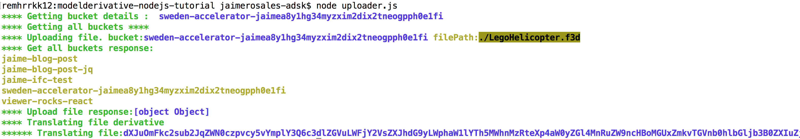

# modelderivative-nodejs-tutorial

## Description

The following project is a demonstration of the use of the Forge API Node package module to recreate the following workflow. 

-	Create a 2-legged authentication token
-	Create a bucket (an arbitrary space to store objects)
-  Get a list of all available buckets
-	Upload a file to the bucket
-	Prepare the file for displaying in the Viewer (translate the file into SVF format)

 

### Steps to debug

Follow these instructions to get the app running locally:

	> git clone <THIS-REPO>
	> cd TO-REPO-PATH	
	> npm install
	> set FORGE_CLIENT_ID=<<YOUR CLIENT ID FROM DEVELOPER PORTAL>
	> set FORGE_CLIENT_SECRET=<<YOUR CLIENT SECRET>
   	> node uploader.js
   	  
This will install all the neccesary dependencies the project has, which are specified in the package.json file, and also run you the steps speciefied before to get as a result the URN of your transalated file. 

This URN can be used in the following project  
[Viewer-nodejs-tutorial] (https://github.com/Autodesk-Forge/viewer-nodejs-tutorial)

## License

This sample is licensed under the terms of the [MIT License](http://opensource.org/licenses/MIT).
Please see the [LICENSE](LICENSE) file for full details.

## Written by
Jaime Rosales D.   
 
Forge Partner Development  
<a href="http://developer.autodesk.com/">Forge Developer Portal</a>  
